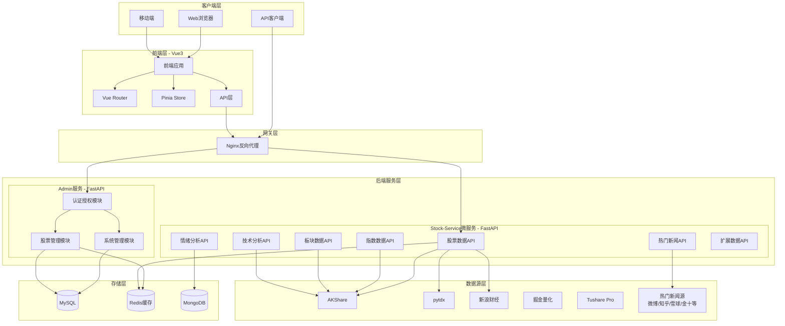
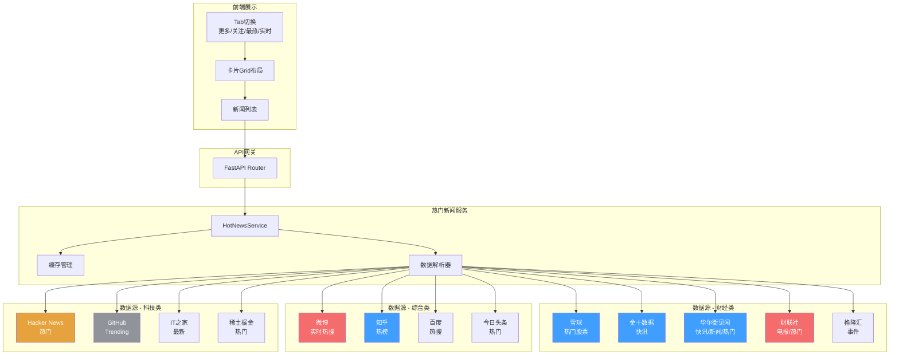
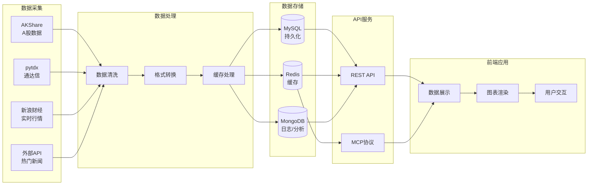
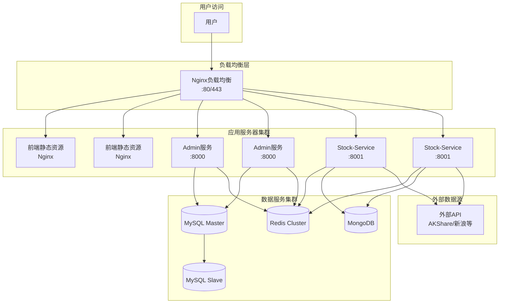
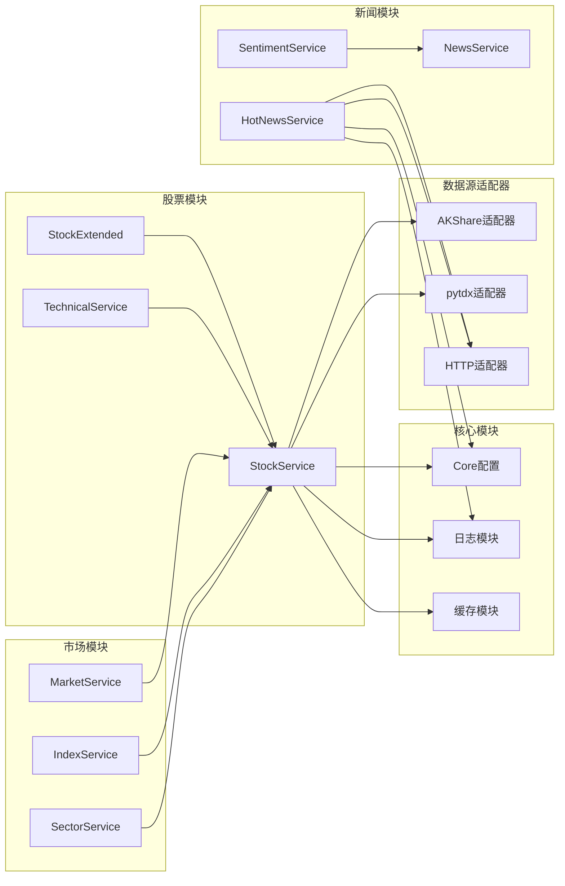

# Easy Rich 股票分析系统架构拓扑图

## 一、整体架构拓扑图

## 二、热门新闻服务架构拓扑

## 三、数据流向拓扑图

## 四、部署架构拓扑

## 五、模块依赖关系图

---

## 架构说明

### 层级划分

| 层级 | 组件 | 职责 |
|------|------|------|
| **客户端层** | Web/Mobile/API Client | 用户交互入口 |
| **网关层** | Nginx | 反向代理、负载均衡、静态资源 |
| **前端层** | Vue3 + Element Plus | 页面渲染、状态管理、API调用 |
| **后端服务层** | FastAPI微服务 | 业务逻辑、数据处理、API提供 |
| **数据源层** | AKShare/pytdx/外部API | 数据采集、实时行情 |
| **存储层** | MySQL/Redis/MongoDB | 数据持久化、缓存、日志存储 |

### 关键特性

1. **微服务架构**: Admin服务与Stock-Service解耦，独立部署
2. **多数据源兼容**: 主备降级策略保证数据可用性
3. **异步处理**: asyncio + httpx实现高并发数据抓取
4. **缓存优化**: Redis缓存减少外部API调用
5. **水平扩展**: 无状态服务设计，支持横向扩展