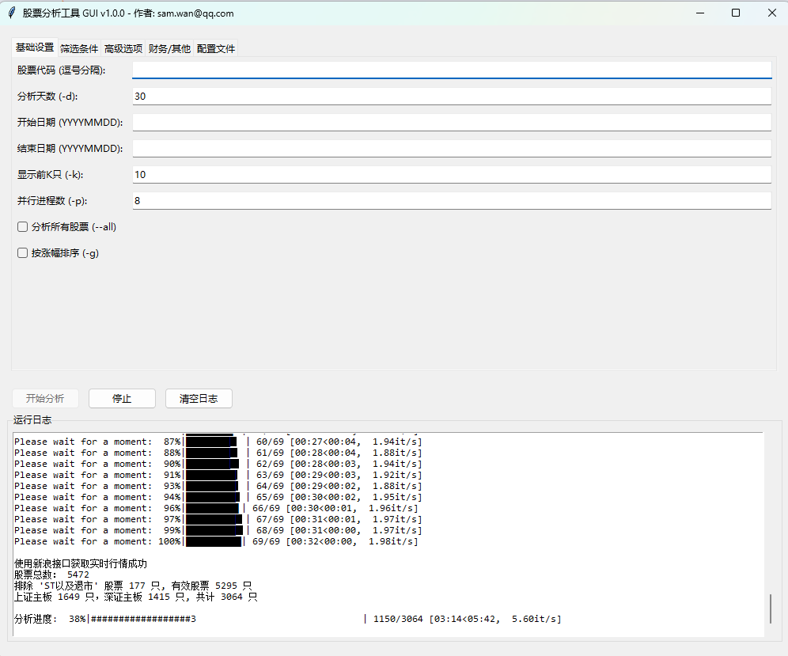
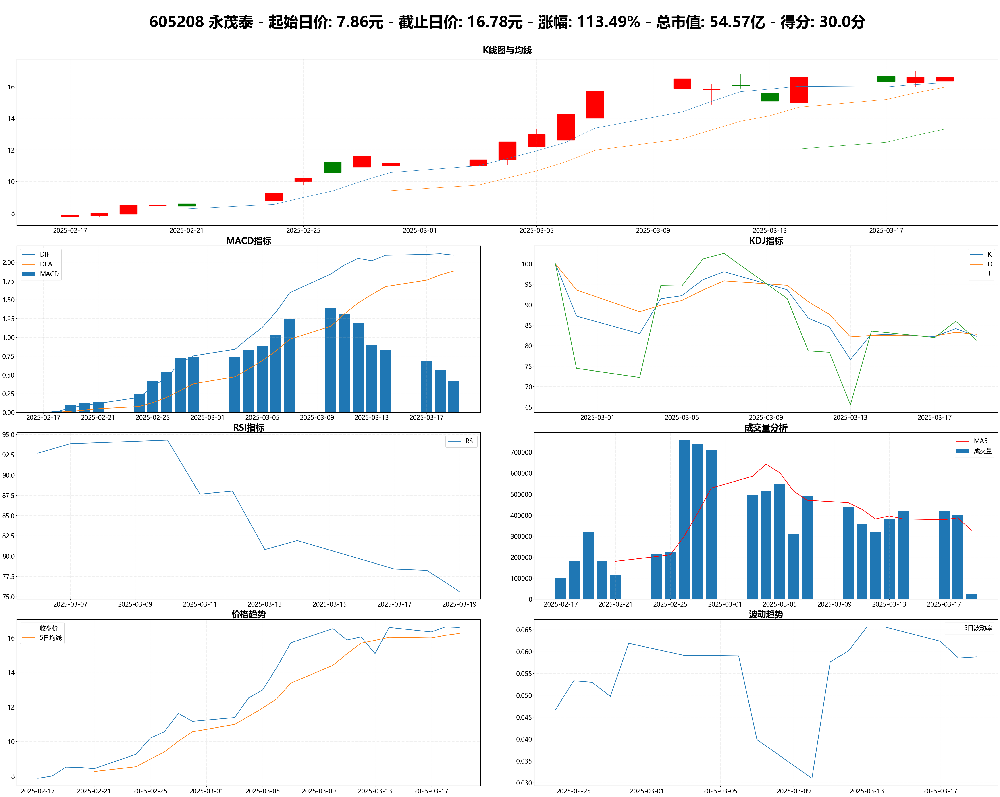
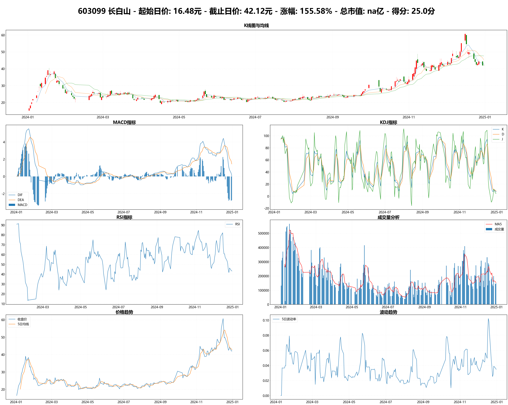
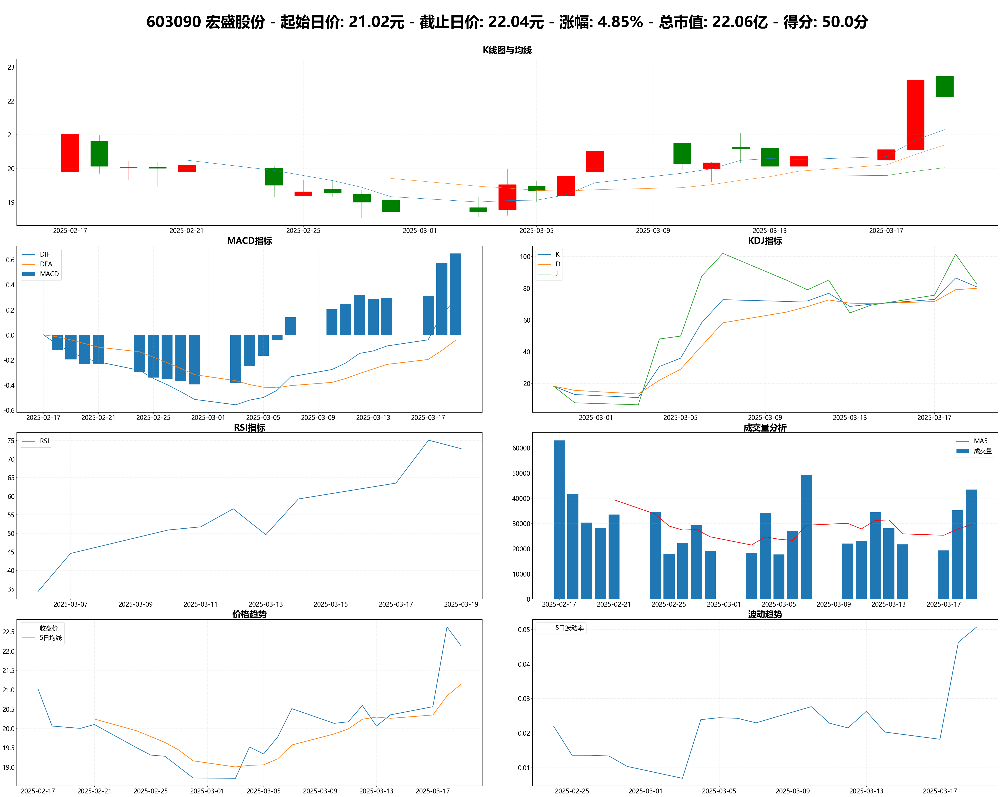
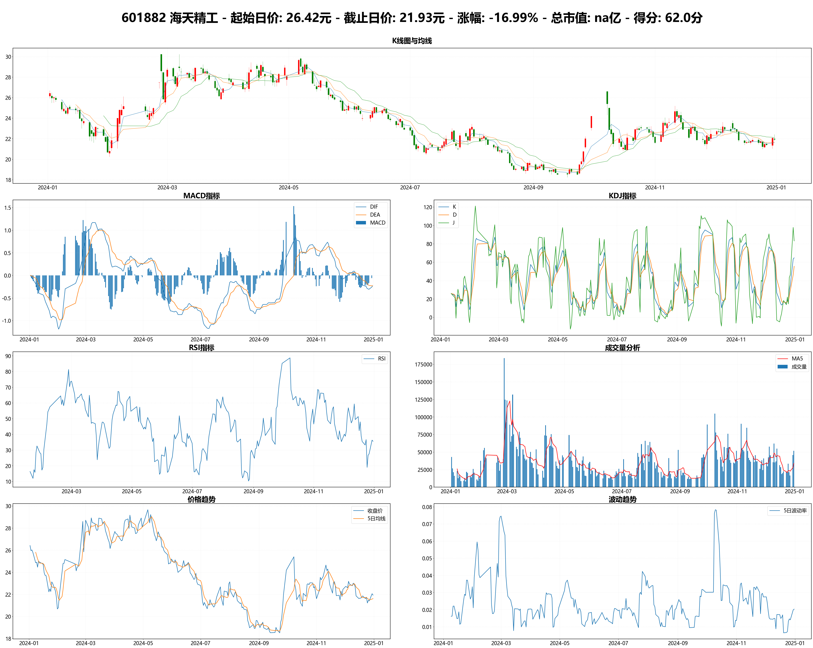

# 股票分析工具

作者: samwan@qq.com

## 功能特点

- 基于技术指标的股票评分系统（总分100分）
- 支持多个技术指标分析：MACD、KDJ、RSI、均线系统、成交量
- 生成详细的技术分析报告和可视化图表
- 自动保存分析结果到 `data_archive` 目录下以程序运行时的时间戳 YYYYMMDD_HHmmss 格式的子目录下
- 多线程并行处理，提高分析效率
- 支持历史数据分析，自动处理市值信息

## 环境配置

### 系统要求
- Python 3.8+
- Windows/Linux/macOS

### 依赖安装
```bash
pip install -r requirements.txt
```

主要依赖包：
- akshare：获取股票数据
- pandas：数据处理
- numpy：数值计算
- matplotlib：图表绘制
- mplfinance：K线图绘制

## 评分系统说明

本工具采用综合技术分析评分系统，通过多个技术指标的组合评估来预测股票的上涨潜力。评分系统包含MACD、KDJ、RSI、均线系统、成交量分析、趋势强度指标和潜力爆发指标等多个维度。

详细的评分算法说明请参考：[scoring_algorithm.md](scoring_algorithm.md)

## 使用说明

详细的命令行参数解释和丰富的使用示例，请参考：[example.md](example.md)

### 基本用法

```bash

# 命令行帮助
python stock_analyze.py -h

# 分析最近30天(默天)所有股票信息，生成按得分排列的csv文件，并生成得分前10名的股票技术指标图表
# (默认行为, 也是当用鼠标双击执行程序的默认行为)
python stock_analyze.py -k 10

# 分析最近60天所有股票信息，生成按得分排列的csv文件，并生成得分前10名的股票技术指标图表
python stock_analyze.py -k 10 -d 60

# 指定日期范围进行历史数据分析（注意：历史数据不包含市值信息），生成按涨幅排列的csv文件，并生成涨幅前10名的股票技术指标图表
python stock_analyze.py -k 10 --start-time 20250101 --end-time 20250315

# 使用更多线程加速分析（默认线程数是8）
python stock_analyze.py -k 10 -p 16

# 分析最近30天所有股票信息，生成按涨幅排列的csv文件，并生成涨幅前10名的股票技术指标图表
python stock_analyze.py -g

# 指定日期范围进行历史数据分析（注意：历史数据不包含市值信息）, 生成按涨幅排列的csv文件，并生成涨幅前10名的股票技术指标图表
python stock_analyze.py -g --start-time 20250101 --end-time 20250315

# 分析指定股票（可以用逗号分隔多个股票代码，默认按得分排序）
python stock_analyze.py -c 600519,000858,002714

# 分析指定多只股票并按涨幅排序（对单只股票无效）
python stock_analyze.py -c 600519,000858,002714 -g

# 分析指定股票的最近60天数据
python stock_analyze.py -c 600519,000858 -d 60

# 分析指定股票指定时间范围内的数据
python stock_analyze.py -c 600519,000858 --start-time 20250101 --end-time 20250315

# 把结果上传到AI服务商分析 （仅对到当前日期的数据有效，如果使用--start-date,--end-date参数，将不会上传AI分析）
python stock_analyze.py -c 600519,000858 --ai

```

### AI分析配置文件

```toml
[llm]
base_url = "<API url>"  # API服务接口， 比如： "https://api-inference.modelscope.cn/v1/"
model = "<AI model>"    # 能识别图片的多模态模型，比如： Qwen-VL 系列
api_key = "<API key>"   # 你的API key

```
程序会按照以下顺序查找 config.toml 配置文件：
1. 当前工作目录
2. EXE文件所在目录（当以打包后的EXE文件运行时）
3. 程序模块所在目录

### 输出结果说明

程序会生成以下输出：

1. csv文件，按照用户输入以得分或者涨幅排序 (多只股票)
2. 排名前K只股票的技术指标分析图表

## 图形界面(GUI)使用说明

提供图形化界面操作，替代复杂的命令行参数输入。



### GUI 特性

- **直观参数配置**：包含基础设置、筛选条件、高级选项、财务/其他和配置文件标签页
- **智能提示**：所有参数控件支持悬停提示（ToolTip），方便理解参数含义
- **灵活筛选**：板块筛选支持多选下拉菜单（包含“所有”选项及自定义输入）
- **交互增强**：
  - 优化下拉菜单交互，支持点击外部自动关闭
  - 分析成功后自动打开结果目录
  - 实时显示分析日志与进度

### 运行方式

```bash
# 运行 Python 脚本
python stock_analyze_gui.py

# 或直接运行打包好的可执行文件
StockAnalyzeGUI.exe
```

## 性能优化

1. 数据获取优化：
   - 使用多进程并行获取股票数据
   - 实现数据缓存机制，避免重复请求

2. 计算优化：
   - 使用向量化运算代替循环
   - 技术指标计算采用滑动窗口

3. 内存管理：
   - 及时释放不需要的数据
   - 使用生成器处理大量数据

## 常见问题

1. 数据获取失败
   - 检查网络连接
   - 确认API访问限制
   - 尝试使用代理服务器

2. 线程数设置
   - 建议设置为CPU核心数的1-2倍
   - 考虑内存占用情况
   - 避免设置过大导致资源竞争

3. 图表显示异常
   - 检查中文字体配置
   - 确认matplotlib版本兼容性
   - 调整图表尺寸和DPI

4. 已知问题
   - 历史数据分析模式下无法获取市值信息（将显示为'na'）.这是由于历史数据API限制导致，暂无解决方案

## 更新日志

详细更新日志请查看 [CHANGELOG.md](CHANGELOG.md)

## 分析示例

以下是使用本工具进行股票分析的实际案例（数据来源：example/20250317_204403）：

### 分析结果展示

1. 永茂泰（605208）
   

2. 长白山（603099）
   

3. 宏盛股份（603090）
   

4. 海天精工（601882）
   

5. 神马股份（600810）AI分析报告（使用"Qwen/Qwen2.5-VL-7B-Instruct"模型）
   

6. 更多示例，请查看 [example](example) 目录下的子目录。

每张分析图包含：
- 上方：K线图与主要均线
- 中间：成交量分析
- 下方：MACD、KDJ、RSI等技术指标

## 免责声明

1. 本程序仅供金融学习与技术研究使用，不构成任何投资建议或推荐。
2. 股市有风险，投资需谨慎。任何投资决策均应建立在投资者独立研究和判断的基础之上。
3. 本程序基于技术分析方法进行股票评分，但技术分析不能预测未来表现，不应作为投资决策的唯一依据。
4. 使用者应对自己的投资决策负责，程序开发者不对因使用本程序输出结果进行投资导致的任何损失承担责任。
5. 在使用本程序前，请务必仔细阅读并理解本免责声明的全部内容。